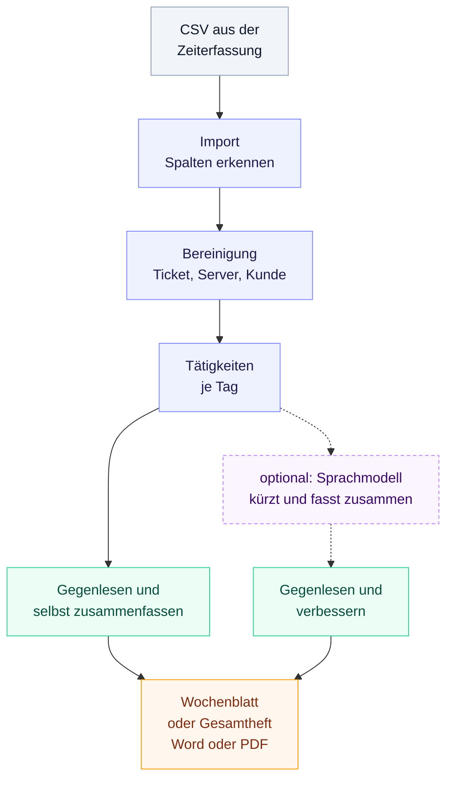
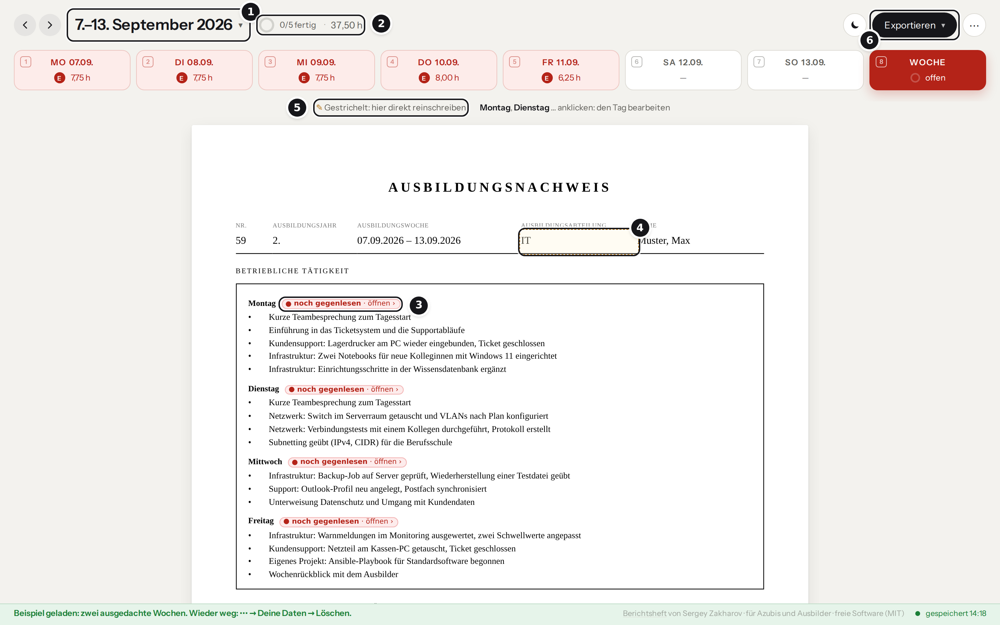
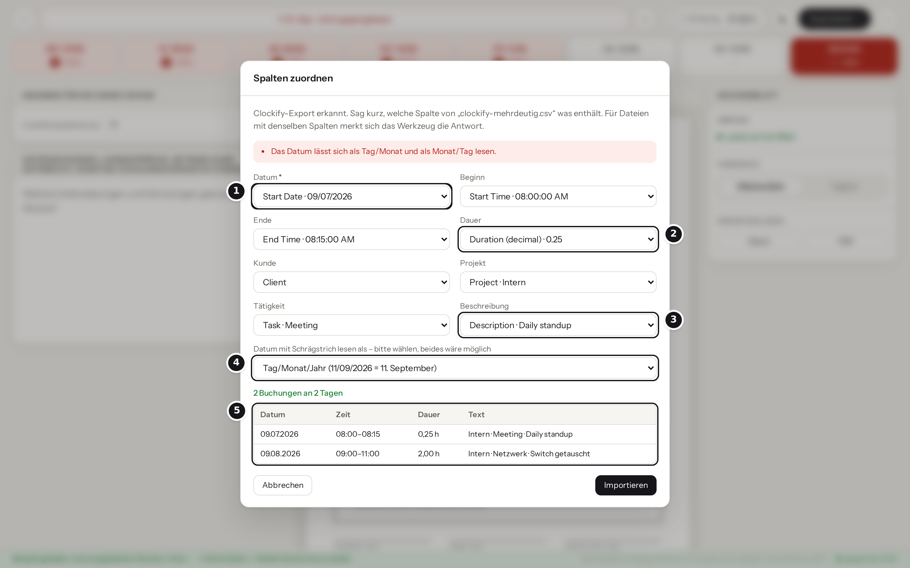
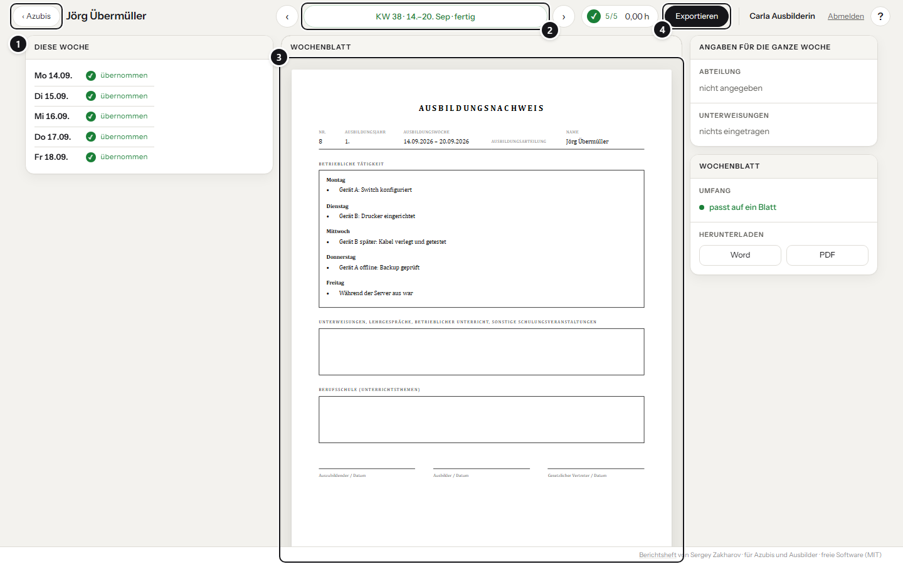

# Berichtsheft

**Der IHK-Ausbildungsnachweis aus dem CSV-Export deiner Zeiterfassung.**

[](https://github.com/SergeyZakh/Ausbildungs-Berichtsheft/actions/workflows/tests.yml)
[](https://github.com/SergeyZakh/Ausbildungs-Berichtsheft/releases/latest)
[](LICENSE)
[](#datenschutz)

---

Zeiten aus der Zeiterfassung hochladen – Clockify, Harvest, Jira mit Tempo, Kimai, Toggl Track
oder eine Excel-Liste –, Wochenblätter oder das ganze Heft nach dem IHK-Vordruck als Word-Datei
oder PDF herunterladen.


---

**[▶ Direkt im Browser ausprobieren](https://SergeyZakh.github.io/Ausbildungs-Berichtsheft/)** — mit
„Beispiel ansehen“, ohne Anmeldung &nbsp;·&nbsp;


**[⤓ Berichtsheft.html herunterladen](https://github.com/SergeyZakh/Ausbildungs-Berichtsheft/releases/latest)**
— eine Datei, läuft offline

---

> [!CAUTION]
> Dieses Werkzeug wurde in erster Linie dafür entwickelt, lokal auf einem Server im Betrieb oder
> auf deinem eigenen PC betrieben zu werden. Ich rate allen davon ab, das Tool mit echten Daten
> öffentlich im Internet bereitzustellen, vor allem den Betrieb mit Konten und Server! Die Demo auf
> GitHub Pages ist davon ausgenommen. Sie ist zum Ausprobieren mit Beispieldaten gedacht, und alle
> Einträge bleiben in deinem Browser.

<br>

> [!TIP]
> Keine technischen Vorkenntnisse? **[Erste Schritte](docs/START.md)** erklärt jeden Schritt
> einzeln – vom Export bis zum fertigen Word- bzw. PDF-Dokument.

<br>

**Alle Anleitungen:**
<br>
[Erste Schritte](docs/START.md) · [KI mit Ollama](docs/KI.md) ·
[Betrieb mit Konten](docs/SERVER.md) · [Entwicklung](docs/ENTWICKLUNG.md) ·
[Mitmachen](CONTRIBUTING.md) · [Änderungen](CHANGELOG.md) · [Sicherheit](SECURITY.md)

---

## Inhalt

[Zwei Betriebsarten](#zwei-betriebsarten) · [Warum?](#warum) · [Wie es arbeitet](#wie-es-arbeitet) ·
[Funktionen](#funktionen) · [Unterstützte Exporte](#unterstützte-exporte) ·
[So wird gearbeitet](#so-wird-gearbeitet) · [Datenschutz](#datenschutz) ·
[Selbst bauen](#selbst-bauen-und-betreiben) · [Mit Konto im Betrieb](#mit-konto-im-betrieb) ·
[Gut zu wissen](#gut-zu-wissen) · [Mitmachen](#mitmachen) · [Lizenz](#lizenz)

## Zwei Betriebsarten

| | Allein im Browser | Im Betrieb mit Server |
| --- | --- | --- |
| **Für** | einzelne Azubis | Ausbildungsbetriebe mit mehreren Azubis |
| **Start** | Demo öffnen oder `Berichtsheft.html` herunterladen | Docker-Stapel mit Postgres und Anmeldung über den Firmen-Anmeldedienst |
| **Daten** | nur im Browser, kein Konto, kein Upload | Nachweisdaten im Konto, auf jedem Gerät; Buchungen aus dem Export bleiben im Browser |
| **Ausbilder** | bekommen das Wochenblatt als Datei | sehen die Hefte ihrer Gruppe, lesen und exportieren sie |
| **Sprachmodell** | optional über ein eigenes Ollama | Ollama läuft im Stapel mit |

<br>

Mehr dazu unter [Mit Konto im Betrieb](#mit-konto-im-betrieb).


1. **Die Woche als Reiter** – Montag bis Sonntag, die Farbe zeigt, was noch fehlt bzw. nicht gegengelesen wurde.

2. **Art des Tages und Stunden** – Arbeitstag, Berufsschule, Urlaub, Krank, Feiertag.

3. **Dein Text** – Hier steht der Entwurf, den du überschreiben kannst.

4. **Entwurf oder fertig** – erst wenn „Fertig“ gedrückt wurde, zählt der Tag als gegengelesen.

5. **Die Buchungen aus dem Export** – bleiben sichtbar, gehen aber nie ins Dokument.

6. **Arbeitsstunden der Woche** und wie viele Tage schon fertig sind.

## Warum?

Wenn du dein Berichtsheft von Hand schreibst, musst du die Positionen der Woche aus der
Zeiterfassung heraussuchen, einzeln in den Vordruck übertragen und dabei so umschreiben, dass
keine Ticketnummer und kein Kundenname mehr darin steht. Außerdem musst du vorher klären, welcher Vordruck bzw. welches Format eigentlich
gilt und was in welches Feld gehört.

Das Werkzeug nimmt dir das Raussuchen und Ausfüllen ab. Aus dem Export werden die täglichen Aufgaben herausgefiltert und in einem leserlichen Format dargestellt. Das Wochenblatt wird dabei komplett mit allen nötigen Angaben wie Kopf- und Unterschriftenzeilen erstellt. Herunterladen kannst du einzelne Wochen oder das ganze Heft samt Deckblatt und Ausbildungsgang. Ein Sprachmodell liefert dir für jeden Tag einen Textentwurf, welchen du gegenlesen und ggf. nachbessern musst. 

> [!IMPORTANT]
> Die Texte bleiben **Entwürfe**. Auch mit Sprachmodell gilt: gegenlesen, bevor du unterschreibst.

## Wie es arbeitet



## Funktionen

- **Import aus jeder Zeiterfassung mit CSV-Export.** Clockify, Harvest, Jira mit Tempo, Kimai
  und Toggl Track werden erkannt, deutsche und englische Spaltennamen ebenso. Datum als
  `14.09.2026`, `2026-09-14` oder `09/14/2026`, Zeiten mit AM/PM, Dauer als `1:30`, `1,5` oder
  `01:30:00`, Excel-Dateien in Windows-1252 oder mit Titelzeilen.

- **Zuordnung, wenn nichts passt.** Unbekannte Spalten zeigt das Werkzeug mit Beispielwerten und
  einer Vorschau. Einmal zuordnen – beim nächsten Export erinnert sich das Tool.

- **Bereinigung.** `Ticket #149725`, `SRV-DC01`, `Herr Weber` und Kundennamen werden zu „Ticket“,
  „Server“, „einem Kollegen“ und „Kunde“. Erkannt wird nach festen Mustern, das trifft nicht jede
  Schreibweise. Was unsicher ist, bleibt lieber stehen, als dass der Satz verdreht wird. Firmen-
  und Produktnamen wie `Windows 10` oder `Friedrich Brandt GmbH` bleiben ohnehin.

- **Gegenlesen und zusammenfassen.** Aus den Tätigkeiten des Tages machst du die Sätze, die ins
  Heft kommen; das Sprachmodell liefert dafür höchstens einen Vorschlag. Ein Tag ist erst fertig,
  wenn du ihn übernimmst. Rot heißt offen, grün fertig.

- **Ausgabe** als Word – Wochenblatt oder Gesamtheft mit Deckblatt – und als PDF über den
  Druckdialog, mit Live-Vorschau des Blatts.

- **Optional mit eigenem Sprachmodell.** [Ollama](https://ollama.com) fasst den Tag in so vielen
  Zeilen zusammen, wie dein Ausbilder verlangt – auf deinem Rechner oder im Docker-Stapel des
  Betriebs.

- **Konten und Ausbilder-Ansicht** mit Server: Anmeldung über Keycloak, Authentik oder Entra ID,
  Offline-Arbeit mit späterem Abgleich, Ausbilder sehen Wochen und Hefte ihrer Gruppe.

> [!NOTE]
> Erprobt ist die Anmeldung bisher **mit Keycloak**. Authentik und Entra ID sprechen dasselbe
> Protokoll (OIDC), sind hier aber noch nicht durchgetestet, da mir derzeit die nötigen Ressourcen fehlen.



1. **Woche wählen** – anklicken öffnet das Monatsraster.
2. **Ausbildungsabteilung** – gilt für die gesamte Woche; ohne Eintrag zählt die aus deinen Stammdaten.
3. **Unterweisungen und Lehrgespräche** – eigenes Feld im Vordruck.
4. **Vorschau des Wochenblatts**
5. **Umfang, KI und Herunterladen** 
6. **Exportieren** – Wochenblatt oder Gesamtheft, als Word oder PDF.

## Unterstützte Exporte

| Quelle | Weg zum Export (Menü je nach Version etwas anders) | Stand |
| --- | --- | --- |
| Clockify | Reports → Detailed → Export → CSV | nach Hilfeseite nachgebaut |
| Harvest | Reports → Time → Detailed → Export → CSV | nach Hilfeseite nachgebaut |
| Jira mit Tempo | Bericht der erfassten Zeiten → Export → CSV | nach Hilfeseite nachgebaut |
| Kimai | Zeiterfassung → Export → CSV | nach Hilfeseite nachgebaut |
| Toggl Track | Reports → Detailed → Export → CSV | nach Hilfeseite nachgebaut |
| Excel, Google Sheets, eigene Listen | als „CSV UTF-8“ speichern | über die Zuordnung |

<br>

> [!NOTE]
> „Nachgebaut“ heißt: Die Testdateien folgen den Spalten aus der Dokumentation des jeweiligen
> Werkzeugs. Einen echten Export von dort hatte ich noch nicht in der Hand.

**Rückmeldungen helfen.** Dein Export klappt nicht oder kostet zu viele Klicks in der Zuordnung?
[Eröffne ein Issue](../../issues/new?template=format.yml) mit einer anonymisierten Kopfzeile und
zwei Beispielzeilen – dann baue ich dein Format ein.

### Spalten manuell zuordnen



1. **Datum** – die einzige Pflichtangabe.
2. **Dauer** – oder Beginn und Ende, je nachdem, was dein Export mitbringt.
3. **Beschreibung** – der Text, aus dem der Entwurf entsteht.
4. **Datum mit Schrägstrich** – nur wenn sich `09/07` als 9. Juli **und** als 7. September lesen lässt.
5. **Die ersten Zeilen zur Kontrolle** – stimmt das Datum, stimmt meist alles. (nicht immer)

## So wird gearbeitet 

1. Zeiten als CSV exportieren und ins Fenster ziehen. Ohne Export? **Ohne Export starten**.
2. Unter **⋯ → Deine Daten** Name, Beruf, Betrieb und Vertragslaufzeit eintragen.
3. Tag für Tag den Entwurf überarbeiten und auf **Fertig** drücken. Im Reiter **Woche** stehen **Abteilung und Unterweisungen**.
4. **Exportieren** → Wochenblatt oder Gesamtheft, als Word oder PDF.

<details>
<summary><strong>Tastaturkürzel</strong></summary>

<br>

| Taste | Wirkung |
| --- | --- |
| `1`–`7` | Tag der Woche wählen |
| `8` | Reiter **Woche** |
| `Alt` + `←` / `→` | eine Woche zurück oder vor |
| `Strg` + `S` | Wochenblatt speichern |

</details>

## Datenschutz

- **Allein im Browser?** Alles bleibt im `localStorage`. Die Datei und die Demo stellen keine
  Anfragen nach außen. Wer die Demo öffnet, lädt die Seite von GitHub Pages, und GitHub sieht
  dabei wie bei jeder Webseite, dass sie abgerufen wurde. Was du einträgst, verlässt deinen
  Browser nicht und sieht niemand außer dir.

- **Mit Server?** Tagestexte, Stunden, Status und Stammdaten gehen in dein Konto beim Betrieb.
  Die Buchungen aus dem Export mit Kunden, Tickets und Uhrzeiten bleiben auch dann in deinem
  Browser.

- **Sprachmodell?** Anfragen gehen nur an das Ollama, das du oder dein Betrieb einträgt. Im
  Container-Betrieb über `/ki` an den Dienst im selben Stapel.

- **Echte Datei?** Jedes [Release](https://github.com/SergeyZakh/Ausbildungs-Berichtsheft/releases/latest)
  nennt die SHA-256-Prüfsumme von `Berichtsheft.html`. Unter Windows zeigt
  `Get-FileHash Berichtsheft.html` in PowerShell den Wert deiner Datei. Stimmt er nicht überein,
  stammt die Datei nicht aus dem Release. Das hilft auch, wenn ein Virenscanner sie meldet.


> [!WARNING]
> **Ohne Konto sind Browserdaten löschen und Heft löschen dasselbe.** Sichere deinen Stand
> regelmäßig unter **⋯ → Sicherung speichern**, das legt eine Datei bei dir ab.

## Selbst bauen und betreiben

Voraussetzung: Node.js 20 oder neuer.

```bash
npm install
npm run build
npm start          # liefert dist/ unter http://localhost:8080 aus
```

| Ergebnis | Verwendung |
| --- | --- |
| `dist/Berichtsheft.html` | Eine Datei mit allem drin. Doppelklicken, fertig auch offline. |
| `dist/index.html` + `dist/vendor/` | Für einen Webserver oder GitHub Pages. |

<details>
<summary><strong>Mit Docker – das Sprachmodell läuft im selben Stapel</strong></summary>

<br>

```bash
docker compose -f docker-compose.lokal.yml up -d --build   # http://localhost:8080
```

Beim ersten Start lädt der Dienst `ollama-modelle` das Modell `qwen3.5:4b` (rund 3,4 GB).
Unter **⋯ → Deine Daten → Sprachmodell** stehen Adresse (`/ki`) und Modell dann schon da – das
Werkzeug sucht sie selbst, solange das Feld leer ist.

**Ohne Sprachmodell?** Nur `docker compose -f docker-compose.lokal.yml up -d --build berichtsheft`
starten.

</details>

Ollama und Docker im Detail → [docs/KI.md](docs/KI.md) · Betrieb mit Server →
[docs/SERVER.md](docs/SERVER.md)

## Mit Konto im Betrieb

Für Ausbildungsbetriebe mit mehreren Azubis gibt es `docker-compose.server.yml`: ein kleiner
Server mit Postgres dazu. Angemeldet wird über den vorhandenen Anmeldedienst (*Keycloak,
Authentik, Entra ID …*), die Rollen kommen aus zwei Gruppen.

- **Azubis** schreiben ihren Nachweis. Die Einträge liegen im Konto und sind auf jedem Gerät da;
  ohne Internet geht es im Browser weiter und gleicht sich später ab.

- **Ausbilder** sehen, welche Wochen und Tage fertig sind, lesen die Wochenblätter und
  exportieren Word und PDF. Ändern können sie nichts.

- Auf den Server kommt nur, was im Nachweis steht. Dabei sind außerdem eine nächtliche Sicherung
  und eine Keycloak-Anmeldeseite im Aussehen des Berichtshefts.

Einrichten, Abgleich, Rechte und Sicherung → [docs/SERVER.md](docs/SERVER.md)



1. **Zurück zur Auswahl** – zur Liste der eigenen Gruppe.
2. **Woche wechseln** – oder über das Monatsraster springen.
3. **Das Wochenblatt**, wie der Azubi es sieht. Ändern kann der Ausbilder nichts.
4. **Herunterladen** – Wochenblatt oder Gesamtheft als Word und PDF.

## Gut zu wissen

- **Am Handy** ist das Werkzeug vorerst gesperrt.
- **Als Datei per Doppelklick** kann Chrome oder Edge in seltenen Fällen einen Tab öffnen, der den
  gespeicherten Stand nicht sieht. Das Werkzeug prüft das beim Start und lädt dann einmal neu. Mit
  `npm start` oder Docker tritt es gar nicht auf. Sichern unter **⋯ → Sicherung speichern** schadet nie.
- **Im Dokument stehen keine Uhrzeiten.**
- **Feiertage** werden bundesweit erkannt. Mit deinem Bundesland unter *Deine Daten → Verarbeitung*
  kommen die Feiertage des Landes dazu. Was nur in einzelnen Gemeinden gilt, etwa Mariä Himmelfahrt
  in Teilen Bayerns, trägst du als Art des Tages ein. Ein Feiertag ohne Eintrag zählt nicht als Lücke.
- **Der Vordruck** folgt dem verbreiteten IHK-Muster „Ausbildungsnachweis – wöchentliche
  Notierung“. Frag bei deiner IHK nach, ob sie eine eigene Form verlangt.

## Mitmachen

- Fehler, Wünsche und neue Exportformate sind willkommen → [CONTRIBUTING.md](CONTRIBUTING.md).
- Architektur, Datenmodell und Regeln → [docs/ENTWICKLUNG.md](docs/ENTWICKLUNG.md).

<br>

> [!CAUTION]
> Sicherheitslücken bitte **nicht** als Issue melden, sondern über den privaten Weg in
> [SECURITY.md](SECURITY.md).

## Lizenz

[MIT](LICENSE) – nutzen, ändern, weitergeben, auch im Betrieb.

Mitgeliefert: die Schrift **Instrument Sans** unter der
[SIL Open Font License 1.1](src/fonts/OFL.txt) und die Word-Bibliothek **docx** unter MIT. Beide
stehen im Kopf der gebauten Datei.
