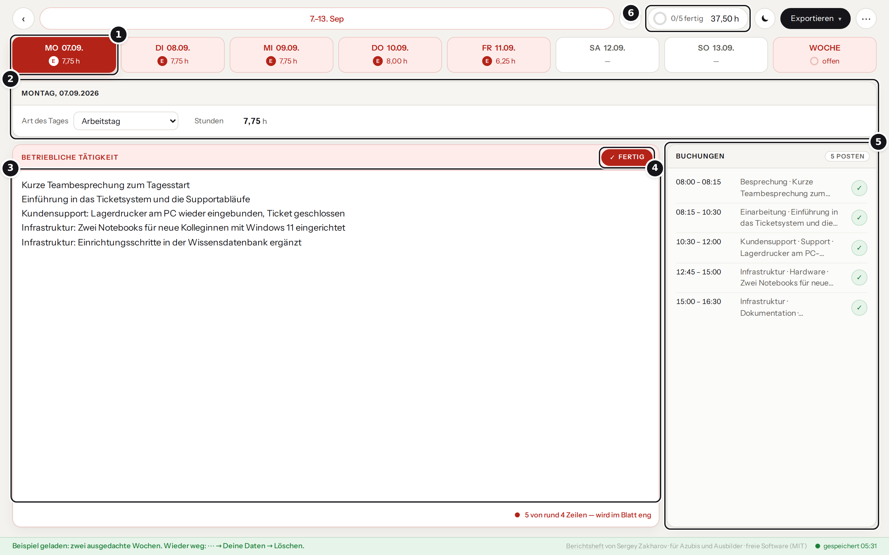

# Berichtsheft

**Der IHK-Ausbildungsnachweis aus dem CSV-Export deiner Zeiterfassung.**

[](https://github.com/SergeyZakh/Ausbildungs-Berichtsheft/actions/workflows/tests.yml)
[](https://github.com/SergeyZakh/Ausbildungs-Berichtsheft/releases/latest)
[](LICENSE)
[](#datenschutz)

Zeiten aus der Zeiterfassung laden – Clockify, Harvest, Jira mit Tempo, Kimai, Toggl Track oder
eine Excel-Liste –, Tag für Tag gegenlesen und die Wochenblätter oder das ganze Heft nach dem
IHK-Vordruck als Word-Datei oder PDF herunterladen. Ohne Zeiterfassung schreibst du die Tage
einfach selbst.

**[▶ Direkt im Browser ausprobieren](https://SergeyZakh.github.io/Ausbildungs-Berichtsheft/)** — mit
„Beispiel ansehen“, ohne Anmeldung, auch am Handy

**[⤓ Berichtsheft.html herunterladen](https://github.com/SergeyZakh/Ausbildungs-Berichtsheft/releases/latest)**
— eine Datei, läuft offline

> [!CAUTION]
> Dieses Werkzeug wurde in erster Linie dafür entwickelt, lokal auf einem Server im Betrieb oder
> auf deinem eigenen PC betrieben zu werden. Ich rate allen davon ab, das Tool mit echten Daten
> öffentlich im Internet bereitzustellen, vor allem den Betrieb mit Konten und Server! Die Demo auf
> GitHub Pages ist davon ausgenommen. Sie ist zum Ausprobieren mit Beispieldaten gedacht, und alle
> Einträge bleiben in deinem Browser.

**Anleitungen:** [Erste Schritte](docs/START.md) (ohne Vorkenntnisse, Schritt für Schritt) ·
[KI mit Ollama](docs/KI.md) · [Betrieb mit Konten](docs/SERVER.md) ·
[Entwicklung](docs/ENTWICKLUNG.md) · [Mitmachen](CONTRIBUTING.md) · [Änderungen](CHANGELOG.md) ·
[Sicherheit](SECURITY.md)

## So geht's

1. Beim ersten Öffnen die **Einrichtung** durchgehen: Name, Beruf, Betrieb, Vertragslaufzeit,
   Bundesland, Berufsschule und Vordruck. Ändern lässt sich alles unter **⋯ → Deine Daten**.
2. Zeiten als CSV exportieren und ins Fenster ziehen oder **Zeiterfassung laden (CSV)** klicken.
   Ohne Zeiterfassung: **Selbst schreiben**.
3. Tag für Tag den Entwurf überarbeiten und auf **Fertig** drücken. Im Reiter **Woche** stehen
   Abteilung und Unterweisungen.
4. **Exportieren** → diese Woche oder das ganze Heft mit Deckblatt, als Word oder PDF.



1. **Die Woche als Reiter** – Montag bis Sonntag, die Farbe zeigt, was noch fehlt oder nicht
   gegengelesen ist.
2. **Art des Tages und Stunden** – Arbeitstag, Berufsschule, Urlaub, Krank, Feiertag.
3. **Dein Text** – hier steht der Entwurf aus den Buchungen, den du überschreibst.
4. **Fertig** – erst dann zählt der Tag als gegengelesen, rot wird grün.
5. **Die Buchungen aus dem Export** – bleiben sichtbar, gehen aber nie ins Dokument.
6. **Arbeitsstunden der Woche** und wie viele Tage schon fertig sind.

> [!IMPORTANT]
> Die Texte bleiben **Entwürfe**, auch mit Sprachmodell: gegenlesen, bevor du unterschreibst.

## Was es kann

- **Import aus jeder Zeiterfassung mit CSV-Export**, deutsche und englische Spaltennamen, viele
  Datums- und Zeitformate. Passt eine Spalte nicht, ordnest du sie einmal zu.
- **Bereinigung:** `Ticket #149725`, `SRV-DC01`, `Herr Weber` und Kundennamen werden zu „Ticket“,
  „Server“, „einem Kollegen“ und „Kunde“. Was unsicher ist, bleibt lieber stehen.
- **Berufsschule:** feste Schultage und Blockunterricht aus der Einrichtung; in einer Woche nur
  mit Schule schreibst du die Themen einmal für die ganze Woche.
- **Ausgabe** als Word oder PDF, im Vordruck mit wöchentlicher oder täglicher Notierung, mit
  Vorschau des Blatts.
- **Übersicht aller Wochen** mit Schul-, Urlaubs- und Krankheitstagen je Ausbildungsjahr.
- **Optional mit eigenem Sprachmodell:** [Ollama](https://ollama.com) fasst den Tag in so vielen
  Zeilen zusammen, wie dein Ausbilder verlangt.

## Unterstützte Exporte

| Quelle | Weg zum Export (Menü je nach Version etwas anders) | Stand |
| --- | --- | --- |
| Clockify | Reports → Detailed → Export → CSV | nach Hilfeseite nachgebaut |
| Harvest | Reports → Time → Detailed → Export → CSV | nach Hilfeseite nachgebaut |
| Jira mit Tempo | Bericht der erfassten Zeiten → Export → CSV | nach Hilfeseite nachgebaut |
| Kimai | Zeiterfassung → Export → CSV | nach Hilfeseite nachgebaut |
| Toggl Track | Reports → Detailed → Export → CSV | nach Hilfeseite nachgebaut |
| Excel, Google Sheets, eigene Listen | als „CSV UTF-8“ speichern | über die Zuordnung |

„Nachgebaut“ heißt: Die Testdateien folgen den Spalten aus der Dokumentation des jeweiligen
Werkzeugs; einen echten Export von dort hatte ich noch nicht in der Hand. Klappt deiner nicht?
[Eröffne ein Issue](../../issues/new?template=format.yml) mit einer anonymisierten Kopfzeile und
zwei Beispielzeilen – dann baue ich dein Format ein.

## Zwei Betriebsarten

| | Allein im Browser | Im Betrieb mit Server |
| --- | --- | --- |
| **Für** | einzelne Azubis | Ausbildungsbetriebe mit mehreren Azubis |
| **Start** | Demo öffnen oder `Berichtsheft.html` herunterladen | Docker-Stapel mit Postgres und Anmeldung über den Firmen-Anmeldedienst |
| **Daten** | nur im Browser, kein Konto, kein Upload | Nachweisdaten im Konto, auf jedem Gerät; Buchungen aus dem Export bleiben im Browser |
| **Ausbilder** | bekommen das Wochenblatt als Datei | sehen die Hefte ihrer Gruppe, lesen und exportieren sie, ändern nichts |
| **Sprachmodell** | optional über ein eigenes Ollama | Ollama läuft im Stapel mit |

Mit Server meldet man sich über Keycloak, Authentik oder Entra ID an; erprobt ist bisher Keycloak.
Einrichten, Abgleich, Rechte und Sicherung stehen in [docs/SERVER.md](docs/SERVER.md).

## Datenschutz

- **Allein im Browser** bleibt alles im `localStorage`. Die Datei und die Demo stellen keine
  Anfragen nach außen; was du einträgst, sieht niemand außer dir. Wer die Demo öffnet, lädt die
  Seite von GitHub Pages, und GitHub sieht wie bei jeder Webseite, dass sie abgerufen wurde.
- **Mit Server** gehen Tagestexte, Stunden, Status und deine Angaben in dein Konto beim Betrieb.
  Die Buchungen aus dem Export mit Kunden, Tickets und Uhrzeiten bleiben in deinem Browser.
- **Das Sprachmodell** bekommt Anfragen nur an die Adresse, die du oder dein Betrieb einträgt.
- **Echte Datei?** Jedes [Release](https://github.com/SergeyZakh/Ausbildungs-Berichtsheft/releases/latest)
  nennt die SHA-256-Prüfsumme von `Berichtsheft.html`, etwa zum Nachsehen, wenn ein Virenscanner
  sie meldet.

> [!WARNING]
> **Ohne Konto sind Browserdaten löschen und Heft löschen dasselbe.** Sichere deinen Stand
> regelmäßig unter **⋯ → Sicherung speichern**, das legt eine Datei bei dir ab.

## Selbst bauen

Mit Node.js 20 oder neuer:

```bash
npm install
npm run build      # dist/Berichtsheft.html: eine Datei mit allem, läuft per Doppelklick
npm start          # liefert dist/ unter http://localhost:8080 aus
```

Mit Docker und Sprachmodell im selben Stapel: [Erste Schritte, Weg 2](docs/START.md#weg-2-für-mehrere-mit-docker-desktop)
und [docs/KI.md](docs/KI.md).

## Lizenz

[MIT](LICENSE) – nutzen, ändern, weitergeben, auch im Betrieb. Fehler, Wünsche und neue
Exportformate sind willkommen ([CONTRIBUTING.md](CONTRIBUTING.md)); Sicherheitslücken bitte nicht
als Issue, sondern über [SECURITY.md](SECURITY.md) melden.

Mitgeliefert: die Schrift **Instrument Sans** unter der
[SIL Open Font License 1.1](src/fonts/OFL.txt) und die Word-Bibliothek **docx** unter MIT. Beide
stehen im Kopf der gebauten Datei.
