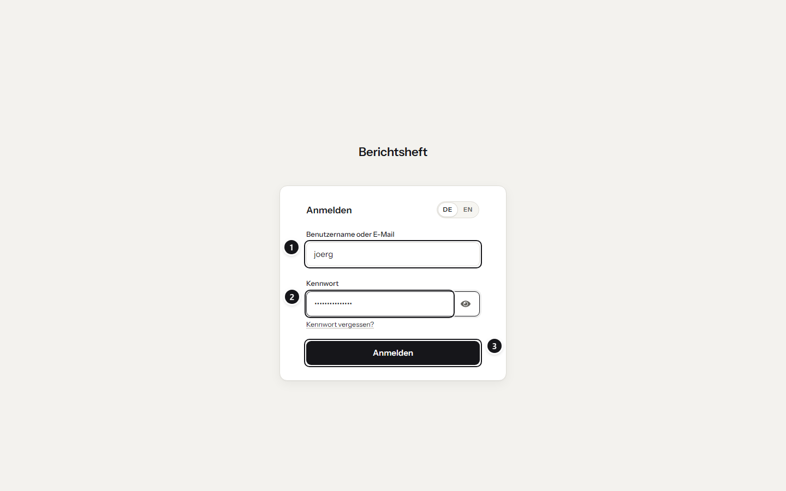
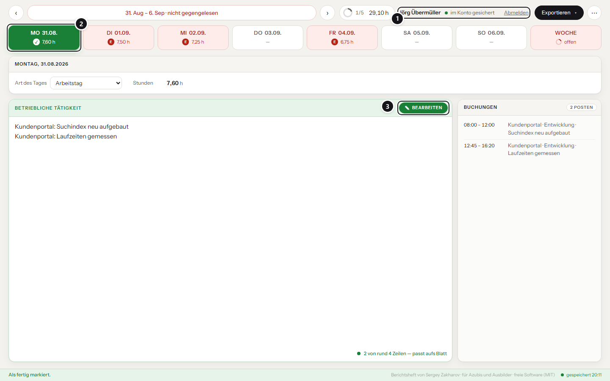
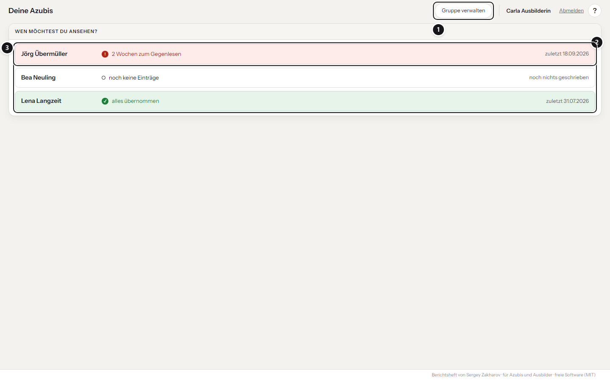
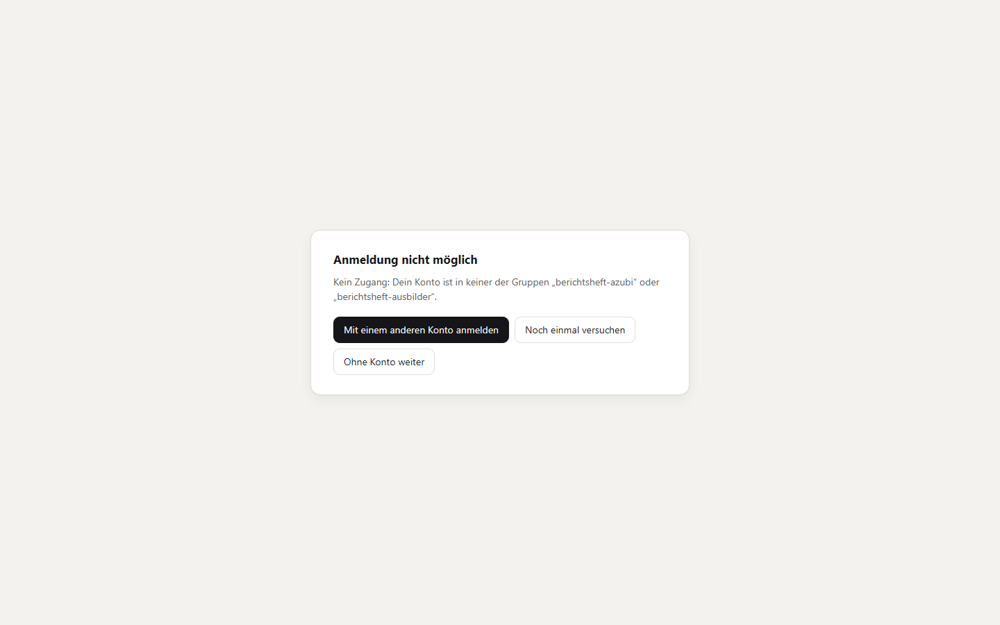
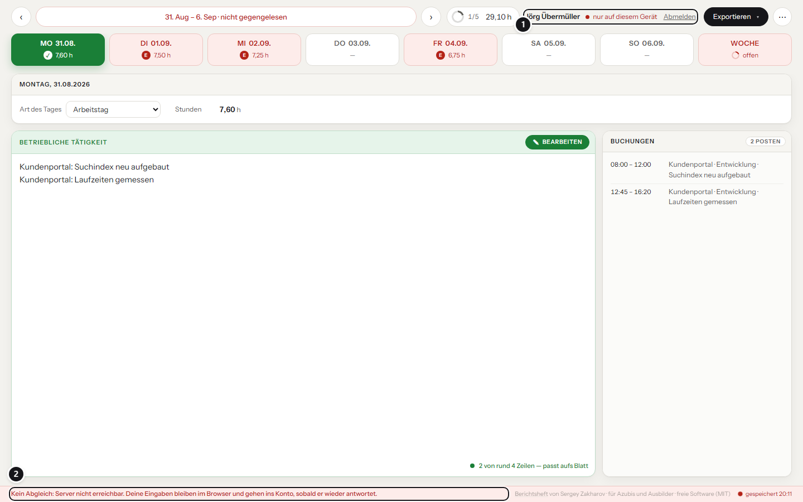
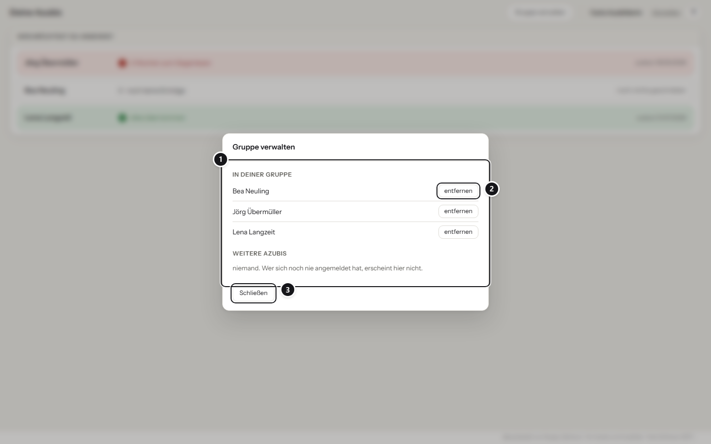
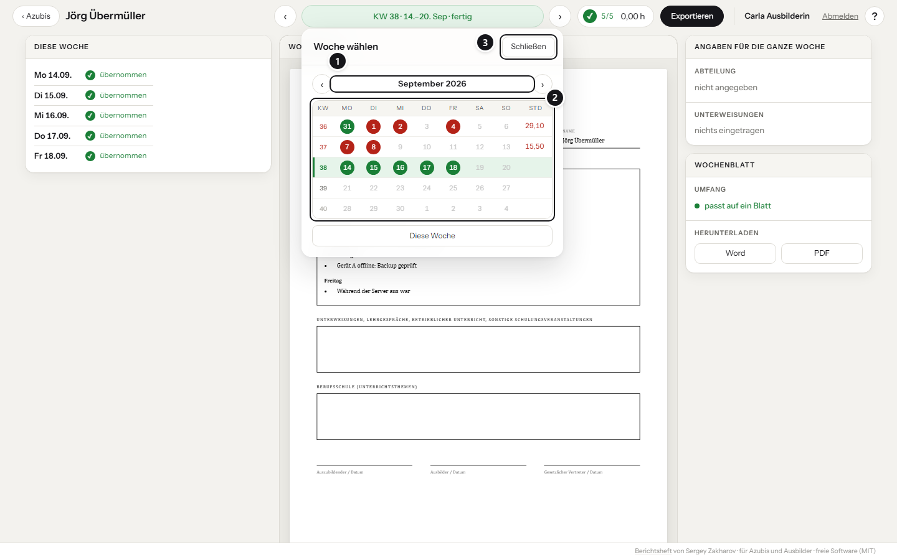

# Berichtsheft mit Konten

Ohne Server ist das Berichtsheft eine Datei, die im Browser läuft und nichts hochlädt. Für viele
Fälle reicht das und soll auch so bleiben. Wer es im Betrieb für mehrere Azubis einsetzt, kann den
**Server** dazunehmen:

- Azubis melden sich mit ihrem Firmenkonto an. Ihre Einträge liegen im Konto und sind auf
  jedem Gerät da.
- Ausbilder sehen die Hefte ihrer Gruppe: welche Wochen fertig sind, die Wochenblätter selbst,
  Export als Word und PDF. Ändern können sie nichts.

Anmeldung über OIDC: Keycloak, Authentik, Entra ID oder einen anderen Anbieter. Rollen kommen
aus zwei Gruppen im Anbieter. Erprobt ist bisher Keycloak, die anderen sprechen dasselbe
Protokoll, sind hier aber noch nicht durchgetestet.

### Anmelden



<br>

1. **Benutzername oder E-Mail** – das Firmenkonto, kein eigenes Kennwort fürs Berichtsheft.
2. **Kennwort** – das Auge daneben zeigt es im Klartext.
3. **Anmelden** – danach geht es zurück ins Berichtsheft.

### Als Azubi



<br>

1. **Wer angemeldet ist und wo die Einträge liegen** – „im Konto gesichert“ oder „nur auf diesem Gerät“.
2. **Stand der Tage** – dieselben Farben wie ohne Konto.
3. **Fertig** – der Text ist gegengelesen und schreibgeschützt; „Bearbeiten“ öffnet ihn wieder.

### Als Ausbilder: die eigene Gruppe



<br>

1. **Gruppe verwalten** – wer zu dir gehört.
2. **Deine Azubis** – eine Zeile je Person.
3. **Stand auf einen Blick** – offen zum Gegenlesen, alles übernommen oder noch nichts geschrieben.

### Als Ausbilder: ein Heft lesen


<br>

1. **Zurück zur Auswahl.**
2. **Woche wechseln** – oder über das Monatsraster springen.
3. **Das Wochenblatt**, wie der Azubi es sieht, auch im Vordruck mit täglicher Notierung, wenn der
   Azubi ihn gewählt hat. Ändern kann der Ausbilder nichts.
4. **Exportieren** – Wochenblatt oder Gesamtheft als Word und PDF.

## Was wo liegt

| Daten | Wo |
| --- | --- |
| Tagestext, Art des Tages, Stunden, „übernommen“ | Browser **und** Server |
| Abteilung und Unterweisungen je Woche | Browser und Server |
| Stammdaten (Name, Beruf, Betrieb, Vertragszeitraum, Schultage, Schulferien, Vordruck …) | Browser und Server |
| Importierte Buchungen: Kunden, Tickets, Uhrzeiten, Kollegennamen | **nur im Browser** |
| Einstellungen des Sprachmodells, Namensliste für die Bereinigung | nur im Browser |
| Letzte Sicherung, weggeklickte Hinweise | nur im Browser |
| Wer wen betreut | Server |
| Name und Rolle aus dem Anmeldedienst | Server |

## Aufbau

```text
Browser ──https──► Reverse Proxy (TLS, eigener)
                      │
                      ▼
               berichtsheft (nginx) ── /           Seite (dist/)
                      │               ── /ki/       Ollama
                      │               ── /api/,     /anmeldung, /abmeldung
                      │ 
                      ▼
                 server (Node) ──────► datenbank (Postgres 17) ◄── sicherung (nachts)
                      │
                      │ 
                      └── Token prüfen ──► Anmeldedienst
```

<br>

| Datei | Inhalt |
| --- | --- |
| `docker-compose.server.yml` | der ganze Dockerstapel, also: nginx, Server, Postgres, Sicherung, Ollama |
| `server/Dockerfile` | Image des Servers (Node 22, nur der Postgres-Treiber) |
| `nginx.conf.template` | leitet `/api/`, `/anmeldung`, `/abmeldung` an `SERVER_HOST`; leer = ohne Server |
| `.env.example` | alle Umgebungsvariablen mit Erklärung |
| `keycloak/realm-berichtsheft.json` | Realm mit Client, Gruppen und Gruppen-Claim |
| `keycloak/themes/berichtsheft/` | Anmeldeseite im Aussehen des Berichtshefts, Du-Form |
| `skripte/sicherung.sh`, `skripte/wiederherstellen.sh` | Sicherung der Datenbank |

<br>

Ohne `SERVER_HOST` antworten die Server-Pfade mit
404, und das Werkzeug zeigt keinen Anmeldeknopf.

## Vor dem Einsatz im Betrieb

Zwei Punkte sind keine Technik, gehören aber vor die Einrichtung. Das hier ist ein Hinweis und
keine Rechtsberatung, im Zweifel fragt ihr eure IHK.

- **Ausbildungsvertrag.** Mit Server führen die Azubis ihr Heft elektronisch. Ob der Nachweis
  schriftlich oder elektronisch geführt wird, muss im Ausbildungsvertrag stehen (§ 11 Abs. 1
  Satz 2 Nr. 12 BBiG in Verbindung mit § 13 Satz 2 Nr. 7 BBiG). Steht dort bisher „schriftlich“, braucht es
  eine Änderung, bevor die Server-Variante das Papierheft ersetzt.

- **Betriebsrat.** Die Ansicht für Ausbilder zeigt, wer wie viele Wochen offen hat und wann
  zuletzt geschrieben wurde. Das Gesetz spricht von Einrichtungen, die zur Überwachung von
  Verhalten oder Leistung „bestimmt“ sind; nach ständiger Rechtsprechung genügt, dass sie dazu
  geeignet sind, auch wenn sie nicht dafür gedacht sind. Wo es einen Betriebsrat gibt, muss er
  deshalb vor der Einführung zustimmen (§ 87 Abs. 1 Nr. 6 BetrVG).

## Einrichten

### 1. Anmeldedienst

**Keycloak, neuer Realm?** 

In der Keycloak-Oberfläche *Create realm → Browse* und
`keycloak/realm-berichtsheft.json` auswählen. Vorher in der Datei `${BERICHTSHEFT_URL}` durch die
Adresse des Berichtshefts ersetzen (etwa `https://berichtsheft.firma.intern`) und
`${BERICHTSHEFT_CLIENT_SECRET}` durch ein Geheimnis, etwa aus `openssl rand -hex 32`.

Startet Keycloak mit dem Flag `--import-realm`, setzt es beide Werte aus gleichnamigen Umgebungsvariablen selbst ein.


**Keycloak, vorhandener Realm?** 

| Einstellung | Wert |
| --- | --- |
| Client ID | `berichtsheft` |
| Client authentication | an (vertraulicher Client) |
| Standard flow | an, alle anderen Flows aus |
| Valid redirect URIs | `https://berichtsheft.firma.intern/anmeldung/rueckkehr` |
| Valid post logout redirect URIs | `https://berichtsheft.firma.intern/` |
| Web origins | `https://berichtsheft.firma.intern` |
| PKCE | S256 |
| Gruppen | `berichtsheft-azubi`, `berichtsheft-ausbilder` |
| Mapper (Client scopes → dedicated) | *Group Membership*, Claim `groups`, *Full group path* aus, *Add to ID token* an |

<br>

**Anmeldeseite im Aussehen des Berichtshefts:** Den Ordner `keycloak/themes/berichtsheft` in den
Keycloak-Container nach `/opt/keycloak/themes/berichtsheft` legen, etwa als Volume im
Compose-Stapel von Keycloak:

```yaml
volumes:
  - ./themes/berichtsheft:/opt/keycloak/themes/berichtsheft:ro
```

Danach Keycloak neu starten und im Realm unter *Realm settings → Themes → Login theme*
`berichtsheft` wählen (der Realm-Import setzt es schon). Das Design ändert nur Farben, Schrift
und Texte; die Vorlagen bleiben die von Keycloak, damit ein Update nichts bricht.

**Authentik oder Entra ID:** Werte in `.env.example`. Wichtig ist nur, dass das ID-Token einen
Claim mit den Gruppennamen trägt.

### 2. Stapel starten

Auf einem Linux-Rechner mit Docker und Docker Compose:

```bash
git clone https://github.com/SergeyZakh/Ausbildungs-Berichtsheft.git && cd Ausbildungs-Berichtsheft
cp .env.example .env
# eintragen: APP_URL, DB_PASSWORD, SITZUNG_GEHEIMNIS, OIDC_ISSUER, OIDC_CLIENT_ID, OIDC_CLIENT_SECRET
docker compose -f docker-compose.server.yml up -d --build
docker compose -f docker-compose.server.yml ps -a
```

- Die Reihenfolge regelt Compose, also erst die Datenbank (gesund), dann der Server (gesund), dann
  nginx. Fällt der Server später aus, liefert nginx die Seite weiter; die Azubis schreiben im
  Browser weiter, und der Abgleich holt nach, sobald er zurück ist.

- Das Sprachmodell lädt der Dienst `ollama-modelle` beim ersten Start (Vorgabe `qwen3.5:4b`,
  änderbar über `KI_MODELL`) und beendet sich danach. Wer kein Sprachmodell will, löscht
  `ollama` und `ollama-modelle` aus der Datei in seinem Fork.

- Nach außen offen ist nur der Dienst `berichtsheft` auf `BERICHTSHEFT_PORT` (Vorgabe
  `127.0.0.1:8080`, also nur für den Rechner selbst). Server, Datenbank und Ollama sind nur im
  Container-Netz erreichbar.

### 3. Reverse Proxy mit TLS

Die Anmeldung braucht https: Mit `https://` in `APP_URL` bekommt das Sitzungs-Cookie das Merkmal
`Secure`, und die meisten Anmeldedienste verlangen eine https-Rückkehradresse. Ein Reverse Proxy
auf demselben Rechner nimmt die Adresse aus `APP_URL` entgegen und leitet an
`127.0.0.1:8080` weiter. Mit [Caddy](https://caddyserver.com/) genügt als `Caddyfile`:

```text
berichtsheft.firma.intern {
    reverse_proxy 127.0.0.1:8080
}
```

Caddy holt das Zertifikat selbst, sofern die Adresse aus dem Internet erreichbar ist; für rein
interne Namen ein Zertifikat der eigenen CA eintragen (`tls /pfad/zert.pem /pfad/schluessel.pem`).
Ein vorhandener Proxy (nginx, Traefik, Apache, IIS) geht genauso: einfache Weiterleitung, keine
besonderen Header nötig.

**Der Server verweigert den Start, wenn `SITZUNG_GEHEIMNIS` kürzer als 32 Zeichen ist oder `TESTANMELDUNG=1` gesetzt ist.**

### 4. Erste Anmeldungen

1. Im Anmeldedienst die Konten in die Gruppen nehmen: Azubis nach `berichtsheft-azubi`,
   Ausbilder nach `berichtsheft-ausbilder`.

2. Jeder Azubi meldet sich **einmal** an. Erst dann kennt ihn der Server.

3. Der Ausbilder meldet sich an, öffnet **Gruppe verwalten** und nimmt seine Azubis auf.
   Ein Azubi kann mehrere Ausbilder haben (Vertretung). Unter `/api/ich` sieht der Azubi,
   wer ihn betreut.

Wer schon Einträge im Browser hat, verliert nichts, denn beim ersten Anmelden gehen sie ins Konto.

## Anmeldung



So sieht es aus, wenn ein Konto in keiner der beiden Gruppen steht: Die Seite nennt die
fehlende Gruppe und bietet an, sich mit einem anderen Konto anzumelden.

### Wie die Anmeldung arbeitet

- Authorization Code mit PKCE, ohne Bibliothek (`server/anmeldung.js`). Das ID-Token wird gegen
  die Schlüssel des Anbieters geprüft, also: Signatur, Aussteller, Empfänger, Ablauf, nonce.

- Die Sitzung steckt in einem signierten Cookie (`HttpOnly`, `SameSite=Lax`, bei https `Secure`),
  gültig `SITZUNG_STUNDEN` (Vorgabe 10). Es gibt keine Sitzungstabelle.

- Mit `ANMELDUNG_PFLICHT=1` (Vorgabe) geht es beim Öffnen gleich zum
  Anmeldedienst; ohne Konto kommt niemand ins Werkzeug. Läuft die Sitzung beim Arbeiten ab, leitet
  die Seite nicht mitten im Tippen weiter, sondern sperrt mit einem Hinweis und dem Knopf
  **Anmelden**; die Eingaben liegen solange im Browser. Hält die Anmeldung nicht (dreimal in einer
  Minute zurück ohne Sitzung), bleibt die Seite mit einem Hinweis stehen statt endlos weiterzuleiten.
  Mit `ANMELDUNG_PFLICHT=0` ist Anmelden ein Angebot. Knopf oben rechts, ohne Konto bleibt alles
  im Browser. Der Server sagt der Seite in der 401-Antwort (`anmeldungPflicht`), was gilt.

- Rolle aus den Gruppen: `berichtsheft-ausbilder` vor `berichtsheft-azubi`. Ohne eine der beiden
  kommt niemand hinein; die Seite bietet dann an, sich mit einem anderen Konto anzumelden.

- Die Konto-ID ist `sub` aus dem Token, also die unveränderliche ID im Anbieter. Namensänderungen
  kommen mit der nächsten Anmeldung.

- Abmelden meldet dich im Berichtsheft und bei der Firmenanmeldung (z. B. Keycloak) ab. Wer danach am selben 
  Rechner auf „Anmelden“ klickt, muss das Kennwort neu eingeben.

## Abgleich



1. **Der Stand in der Kopfleiste** – hier „nur auf diesem Gerät“.
2. **Die Meldung dazu** – die Eingaben bleiben im Browser und gehen ins Konto, sobald der Server wieder antwortet.

In der Kopfleiste steht, wo die Einträge liegen: **im Konto gesichert** oder **nur auf diesem Gerät**.

- Drei Sekunden nach einer Änderung geht sie zum Server, beim Verlassen der Seite sofort.

- Jeder Tag und jede Woche (Abteilung, Unterweisungen) trägt die Uhrzeit der letzten Änderung auf
  dem Gerät. **Der neuere Stand gewinnt**, auf dem Server und auf jedem Gerät. Innerhalb eines Tages
  oder einer Woche wird nichts zusammengeführt. Hochgeladen wird nur, was sich geändert hat: Wer an
  einem Gerät eine Woche ausfüllt, überschreibt nicht, was ein anderes in eine andere Woche schrieb.
  Wer einen Stand ändert, stempelt immer später als dieser Stand, auch wenn die Uhr seines Geräts
  hinter der des Geräts zurückliegt, von dem der Stand kam.

- Heruntergeladen wird, was seit dem letzten Abgleich **beim Server eingegangen** ist, nicht was
  seitdem geschrieben wurde. Sonst käme ein Tag, den ein Gerät morgens offline geschrieben und
  abends hochgeladen hat, nie bei einem Gerät an, das mittags abgeglichen hat.

- Ohne Netz oder bei ausgefallenem Server bleibt alles im Browser. Das Werkzeug sagt es einmal
  und versucht es alle 20 Sekunden erneut.

- Ist die Sitzung abgelaufen, erscheint wieder **Anmelden**. Nach der Anmeldung geht, was
  inzwischen geschrieben wurde, ins Konto.

- Was hochgeht, entscheidet die Uhr des Browsers: alles, was seit dem letzten erfolgreichen
  Hochladen geändert wurde. Die Uhr des Servers steuert nur, was herunterkommt. So geht auch eine
  Eingabe während eines laufenden Abgleichs oder auf einem Rechner mit falsch gehender Uhr nicht verloren.

- **Löschen mit Konto:** „Alles löschen“ gibt es für angemeldete Azubis nicht, der Stand käme
  sofort aus dem Konto zurück; gelöscht wird im Konto nur über den Betrieb. „Importierte Daten
  verwerfen“ wirkt auch im Konto: Tage mit Importtext bleiben leer stehen, damit „jetzt leer“ beim
  Server und beim Ausbilder ankommt. Es gilt nur für Importe in diesem Browser, denn Buchungen und
  Entwürfe gehen nie ins Konto.

## Ansicht für Ausbilder



1. **In deiner Gruppe** – wer schon aufgenommen ist.
2. **Entfernen** – nimmt nur das Lesenrecht weg, die Einträge des Azubis bleiben unberührt.
3. **Schließen.** Unter „Weitere Azubis“ stehen alle, die sich schon einmal angemeldet haben und
   noch nicht in deiner Gruppe sind, im Bild niemand. Wer sich noch nie angemeldet hat, erscheint dort nicht.



1. **Monat wechseln.**
2. **Eine Zeile je Woche** – Kalenderwoche, die fünf Werktage und die Stunden.
3. **Schließen.**

- Je Azubi, wie viele Wochen zum Gegenlesen offen oder unvollständig sind und
  wann zuletzt etwas geschrieben wurde. Es gelten dieselben Regeln wie im Heft des Azubis:
  Urlaub, Krank und Feiertag sind frei; Berufsschule und Betriebsversammlung brauchen Text wie
  ein Arbeitstag; ein Werktag ohne Text fehlt, auch wenn sein Text geleert wurde. Hat eine Woche
  Themen für die Berufsschule (Blockwoche), zählt jeder Werktag ohne eigenen Text, der nicht frei
  ist, mit deren Stand; links steht dann „Blockwoche, übernommen“.

- In der Mitte das Wochenblatt aus demselben Drucksatz wie Word und PDF, links der Stand je Tag, rechts
  die Angaben der Woche und eine Karte „Wochenblatt“ mit dem Umfang. Word und PDF gibt es über
  „Exportieren“ oben.

- Eigener Rundgang beim ersten Anmelden, danach über **?** oben rechts. Person und **Abmelden** stehen in
  derselben Leiste.

- Der Ausbilder kann Wochenblatt und Gesamtheft als Word oder PDF exportieren. 

## Datenmodell

Das Schema legt der Server beim Start an (`server/datenbank.js`); neue Spalten kommen mit
`ADD COLUMN IF NOT EXISTS`, eine Migration von Hand ist nicht nötig. Beim Start entfernt er auch
Einstellungen aus den Stammdaten, die im Browser bleiben (`NUR_IM_BROWSER`) und vor 0.1.0 noch
mitkamen. Ältere Sicherungen der Datenbank enthalten sie weiterhin.

| Tabelle | Schlüssel | Inhalt |
| --- | --- | --- |
| `personen` | `id` (`sub`) | Name, Rolle, angelegt, zuletzt gesehen |
| `betreuung` | Ausbilder, Azubi | wer wen sieht |
| `stammdaten` | Person | Felder des Vordrucks als JSON |
| `tage` | Person, Datum | Text, Art, Stunden, geprüft, `geaendert` (Gerät), `eingegangen` (Server) |
| `wochen` | Person, Montag | Abteilung, Unterweisungen, Themen einer Blockwoche (`schule`, `schule_geprueft`), `geaendert`, `eingegangen` |

## Schnittstelle

| Weg | Wer | Zweck |
| --- | --- | --- |
| `GET /api/ich` | alle | Name, Rolle; bei Azubis die Ausbilder |
| `POST /api/abgleich` | Azubi | eigenen Stand hoch- und herunterladen (`seit`, optional `von`/`bis`) |
| `GET /api/azubis` | Ausbilder | Übersicht der Gruppe mit Wochenständen |
| `GET /api/azubis/<id>` | Ausbilder | Einträge eines betreuten Azubis |
| `GET /api/gruppe` | Ausbilder | eigene Gruppe und weitere Azubis |
| `POST /api/gruppe` | Ausbilder | Azubi aufnehmen (`azubi_id`) |
| `DELETE /api/gruppe/<id>` | Ausbilder | Azubi aus der eigenen Gruppe nehmen |
| `GET /gesund` | Healthcheck | `{ "ok": true }` |

`<id>` ist `sub` aus dem Token, kodiert mit `encodeURIComponent`. So gehen auch IDs mit `@`, `:`
oder `+`, etwa wenn Authentik die E-Mail als `sub` schickt.

Fremde Hefte gibt es nicht: Ein Azubi erreicht nur sein eigenes, ein Ausbilder nur die seiner
Gruppe (sonst 404). Anfragen sind auf 2 MB begrenzt; drei Ausbildungsjahre mit vollen Tagen
sind knapp 500 KB. `POST` nimmt nur `Content-Type: application/json` an (sonst 415), siehe
„Sicherheit“.

## Sicherung

Der Dienst `sicherung` sichert jede Nacht um `SICHERUNG_UHRZEIT` (Vorgabe 02:30) mit `pg_dump`
nach `/sicherungen/<JJJJ-MM-TT_HHMM>/` im Volume `sicherungen` und löscht Sicherungen, die älter
als `SICHERUNG_TAGE` (14) sind. Ein Dump ohne Tabelle `tage` wird verworfen.

```bash
S="docker compose -f docker-compose.server.yml"

# Sofort sichern, etwa vor einem Update
$S exec sicherung sh /skripte/sicherung.sh jetzt

# Wiederherstellen: Server anhalten, Sicherung wählen, einspielen, Server starten
$S stop server
$S exec sicherung sh /skripte/wiederherstellen.sh               # listet die Sicherungen
$S exec sicherung sh /skripte/wiederherstellen.sh 2026-09-16_0230
$S start server
```

Die Wiederherstellung prüft die Prüfsumme, bricht ab, solange der Server läuft, und ersetzt die
Datenbank in einer Transaktion. Sitzungen bleiben gültig.
Das Volume liegt auf demselben Rechner wie die Datenbank. **Mindestens eine Kopie gehört woanders
hin**, etwa über die Sicherung des Rechners oder ein nächtliches `rsync` des Volumes.

## Update

1. `$S exec sicherung sh /skripte/sicherung.sh jetzt`

2. `git pull`, dann `$S up -d --build`. Das Schema passt der Server beim Start selbst an.

3. Neu laden genügt im Browser; die Einträge liegen im Konto und im Browser.

Die Datenbank bleibt auf Postgres 17. Eine neue Hauptversion liest die Daten der alten nicht und
startet auf dem bestehenden Volume nicht. Der Wechsel geht nur über eine Sicherung: sichern, Stapel
anhalten, Volume der Datenbank entfernen, Image-Version in `docker-compose.server.yml` erhöhen,
starten und die Sicherung einspielen. Dependabot schlägt ihn deshalb nicht vor
(`.github/dependabot.yml`).

## Sicherheit

| | |
| --- | --- |
| Server | schreibgeschützt, Benutzer `node`, keine Linux-Capabilities, 256 MB, `no-new-privileges` |
| nginx | wie ohne Server (docs/KI.md, B5); CSP erlaubt nur die eigene Herkunft |
| Datenbank | kein Port nach außen, Passwort aus `DB_PASSWORD` |
| Cookie | signiert (HMAC-SHA256), `HttpOnly`, `SameSite=Lax`, bei https `Secure` |
| Fremde Formulare | `SameSite=Lax` hält nur andere Sites ab, nicht andere Hosts derselben Firma. Deren Formulare schicken das Cookie mit, können aber kein `application/json` senden; der Server weist jeden `POST` ohne diesen Typ ab (415). |
| Testanmeldung | Nur für automatische Tests. `TESTANMELDUNG=1` schaltet die Anmeldung ab, der Server glaubt dann den HTTP-Headern `X-Person`, `X-Name` und `X-Rolle`. Das Server-Image verweigert damit den Start. |

## Tests

```bash
bash server/test/testen.sh          # Server gegen Postgres im Container, dazu test/konto.js
bash server/test/betrieb.sh         # der ganze Stapel mit echtem Keycloak, rund 3 Minuten
bash server/test/betrieb.sh --bilder     # dazu die Bilder in docs/bilder/server/ erneuern
bash server/test/betrieb.sh --behalten   # Stapel danach stehen lassen
```

Der Teststapel startet **kein Ollama** (`profiles: ["nie"]` in `server/test/docker-compose.betrieb.yml`), damit ein
Testlauf keine 3,4 GB lädt; `/ki` zeigt auf Port 11434 des eigenen Rechners. Für die KI beim Ausprobieren
mit `--behalten`:

```bash
docker run -d --name ollama -p 127.0.0.1:11434:11434 -v ollama:/root/.ollama ollama/ollama:0.34.2
docker exec ollama ollama pull qwen3.5:4b
```

| Datei | Prüft |
| --- | --- |
| `server/test/anmeldung.js` | Token, Signatur, nonce, Rollen, Cookie gegen einen nachgebauten Anbieter |
| `server/test/server.js` | Schnittstelle, Abgleich, Rechte, Wochenstände (auch Feiertage je Bundesland, Berufsschule und Blockwochen; ein älterer Browser ohne `schule` leert die Themen nicht), Konto-IDs mit `@` und `+`, Aufräumen beim Start gegen Postgres |
| `test/konto.js` | Browser mit nachgestellter Anmeldung: Abgleich, zweites Gerät (auch Wochenangaben und Neuladen), Ausbilder-Ansicht |
| `test/betrieb.js` | Stapel aus `docker-compose.server.yml` mit Keycloak, Anmeldung über die echte Seite |

`test/betrieb.js` meldet sich mit sechs Konten an (zwei Azubis, eine neue Azubine ohne Einträge,
zwei Ausbilder, ein Konto ohne Gruppe) und prüft: Anmeldung, abgewiesenes Konto und Kontowechsel,
gefälschte und abgelaufene Cookies, Import ohne Buchungen auf dem Server, zwei Geräte gleichzeitig,
offline und mit gestopptem Server, Gruppe, Wochenblatt, Monatsraster, Export, Rechte, Abmelden
beim Anbieter, Sicherung und Wiederherstellung. Dazu drei Ausbildungsjahre (784 Tage mit je sechs
Zeilen); gemessen auf einem Arbeitsplatzrechner:

| Vorgang | Dauer |
| --- | --- |
| drei Jahre hochladen (477 KB) | 0,3 s |
| neuer Browser: anmelden und alles herunterladen | 0,9 s |
| Übersicht der Gruppe | < 0,1 s |
| Heft mit drei Jahren öffnen | 0,1 s |
| Gesamtheft als Word | 1,1 s |
| Gesamtheft als PDF vorbereiten | 1,5 s |

## Wenn etwas klemmt

| Anzeichen | Ursache | Abhilfe |
| --- | --- | --- |
| Seite springt nicht zur Anmeldung | `ANMELDUNG_PFLICHT=0` gesetzt | Variable weglassen oder auf 1 |
| „Die Anmeldung hat nicht gehalten“ | Sitzungs-Cookie kommt nicht zurück, meist https in `APP_URL`, Aufruf über http | Seite über die Adresse aus `APP_URL` öffnen |
| Kein Anmeldeknopf | `SERVER_HOST` leer oder Server nicht erreichbar | `docker compose logs berichtsheft server` |
| „Anmeldedienst antwortet nicht“ | `OIDC_ISSUER` falsch oder vom Container aus nicht erreichbar | `docker compose exec server wget -qO- $OIDC_ISSUER/.well-known/openid-configuration` |
| Keycloak meldet „Invalid redirect uri“ | `APP_URL` passt nicht zu den Redirect URIs des Clients | beide genau gleich schreiben, ohne Schrägstrich am Ende |
| „Token kommt von woanders“ | Aussteller im Token ≠ `issuer` aus der Discovery | Keycloak mit `KC_HOSTNAME` auf die öffentliche Adresse stellen |
| „Kein Zugang“ trotz Gruppe | Gruppen-Claim fehlt im ID-Token oder trägt den Pfad | Mapper prüfen: Claim `groups`, *Full group path* aus, *Add to ID token* an |
| Nach der Anmeldung gleich wieder abgemeldet | `APP_URL` mit https, Seite aber über http geöffnet (Secure-Cookie) | Seite über die Adresse aus `APP_URL` öffnen |
| Ausbilder sieht einen Azubi nicht | Azubi hat sich noch nie angemeldet | einmal anmelden lassen, dann **Gruppe verwalten** |
| Server startet nicht: „Start verweigert“ | `SITZUNG_GEHEIMNIS` zu kurz oder `TESTANMELDUNG` gesetzt | Meldung lesen, Variable korrigieren |
