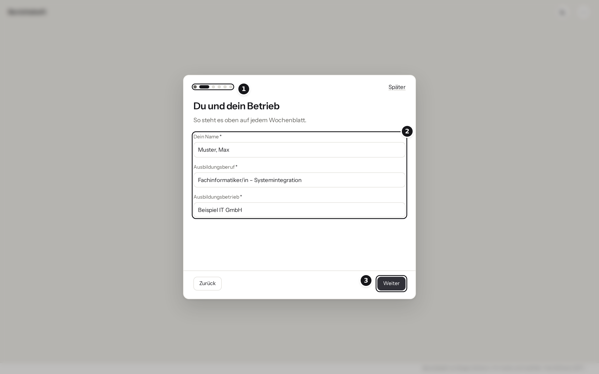
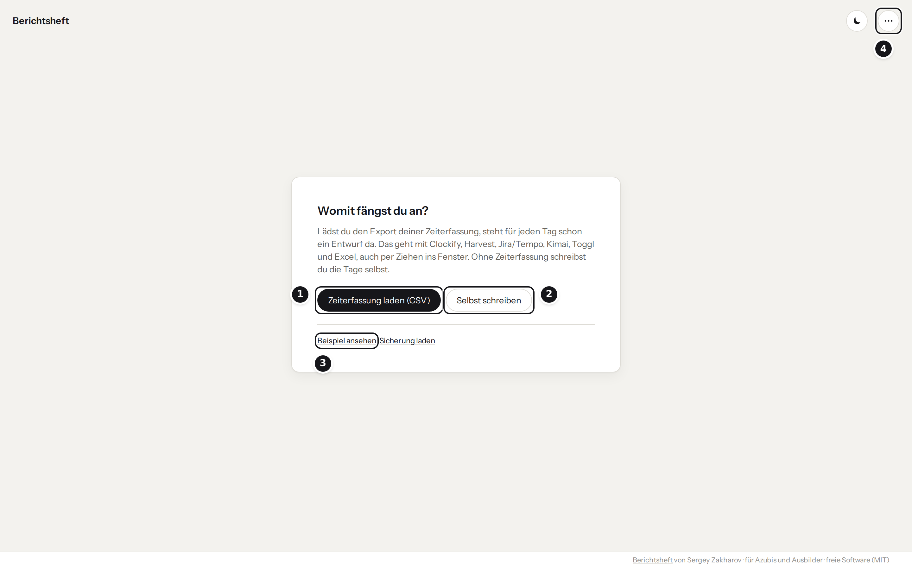

# Erste Schritte

Diese Anleitung ist für alle, die das Berichtsheft einfach nutzen wollen, ohne sich tief mit
Programmierung oder Servern zu beschäftigen. Die technische Dokumentation steht in
[KI.md](KI.md) und [SERVER.md](SERVER.md).

## Welcher Weg passt zu dir?

| Du möchtest … | Weg | Was du installieren musst |
| --- | --- | --- |
| dein eigenes Berichtsheft schreiben | [Weg 1](#weg-1-berichtsheft-im-browser) | nichts |
| zusätzlich Texte von einer KI zusammenfassen lassen | [Weg 1](#weg-1-berichtsheft-im-browser) + [KI dazu](#ki-dazu-optional) | Ollama und Node.js |
| das Berichtsheft für mehrere Azubis im Betrieb bereitstellen, mit KI | [Weg 2](#weg-2-für-mehrere-mit-docker-desktop) | Docker Desktop |
| Konten für Azubis und eine Ansicht für Ausbilder | Weg 3: Das richtet die IT ein, Anleitung in [SERVER.md](SERVER.md) | – |


## Weg 1: Berichtsheft im Browser

### Das brauchst du

| Was | Wo bekommst du es |
| --- | --- |
| Einen Rechner mit Windows, macOS oder Linux | – |
| Einen aktuellen Browser: Chrome, Edge oder Firefox | ist meist schon installiert |
| Die Datei `Berichtsheft.html` | [Releases-Seite](https://github.com/SergeyZakh/Ausbildungs-Berichtsheft/releases/latest), unter „Assets“ |
| Den Export deiner Zeiterfassung als CSV-Datei | aus deiner Zeiterfassung, siehe Schritt 2 |

<br>

**Ausprobieren ohne Download?** Die [Demo](https://SergeyZakh.github.io/Ausbildungs-Berichtsheft/) öffnen und
in der Einrichtung **erst das Beispiel ansehen** klicken.

### Schritt für Schritt



Beim ersten Öffnen kommt die **Einrichtung**: **1** wie weit es noch ist, **2** die Angaben dieses
Schritts, **3** weiter zum nächsten. Mit **Später** geht es ohne Angaben weiter.



Im Startbild: **1** Zeiterfassung laden (Schritt 4), **2** selbst schreiben, ohne Zeiterfassung,
**3** Beispiel ansehen – zwei ausgedachte Wochen zum Ausprobieren, jederzeit wieder löschbar,
**4** das Menü **⋯** mit „Deine Daten“, der Übersicht und Sicherung speichern und laden.

1. **Datei herunterladen.** Auf der [Releases-Seite](https://github.com/SergeyZakh/Ausbildungs-Berichtsheft/releases/latest)
   unter „Assets“ auf `Berichtsheft.html` klicken. Die Datei an einem festen Ort speichern,
   zum Beispiel in *Dokumente*. Doppelklick öffnet sie im Browser. Eine Internetverbindung
   wird nicht benötigt.

2. **Einrichten.** Beim ersten Öffnen fragt die Einrichtung in wenigen Schritten, was auf jedem
   Wochenblatt steht: Name, Ausbildungsberuf, Betrieb, Vertragslaufzeit, das Bundesland für die
   Feiertage, deine Berufsschule mit festen Schultagen und Blockunterricht (im Kalender: ersten Tag
   antippen, dann den letzten) und den Vordruck, wöchentlich oder täglich. Leere Tage an Schultagen
   stehen dann schon auf „Berufsschule“. Ändern lässt sich alles unter **⋯ → Deine Daten**,
   Schulferien stehen dort unter **Schule**.

3. **Zeiten exportieren.** In deiner Zeiterfassung die Zeiten der gewünschten Wochen als CSV
   exportieren. Wo das Menü liegt, steht im README unter
   [Unterstützte Exporte](../README.md#unterstützte-exporte). Ohne Zeiterfassung überspringst du
   diesen Schritt und klickst **Selbst schreiben**.

4. **Zeiterfassung laden.** Auf **Zeiterfassung laden (CSV)** klicken und die Datei wählen, oder
   sie einfach ins Browserfenster ziehen. Erkennt das Werkzeug die Spalten nicht sicher, fragt es
   nach. Jede Spalte einmal zuordnen, beim nächsten Mal weiß es Bescheid. Danach steht oben, was
   geladen wurde („Kimai-Import fertig. 7 Tage …“); **Spalten prüfen** ordnet neu zu, **Passt**
   schließt die Karte.

   

   **1** Datum, die einzige Pflichtangabe. **2** Dauer, oder Beginn und Ende, je nachdem, was dein
   Export mitbringt. **3** Beschreibung, der Text, aus dem der Entwurf entsteht. **4** Datum mit
   Schrägstrich, nur wenn sich `09/07` als 9. Juli **und** als 7. September lesen lässt. **5** Die
   ersten Zeilen zur Kontrolle: Stimmt das Datum, stimmt meist alles.

5. **Tage durchgehen.** Für jeden Tag steht ein Entwurf aus deinen Buchungen da. Lies ihn, ändere
   ihn bei Bedarf und klicke **Fertig**. Rot heißt offen, grün heißt fertig; was die Zeichen in den
   Reitern heißen, erklärt der Kalender unter der Woche oben; blassrot sind dort Werktage, an denen
   noch gar nichts steht. Im Reiter **Woche** steht dein Wochenblatt, und du schreibst direkt
   hinein: Abteilung und Unterweisungen sind gestrichelte Felder im Blatt, in einer Blockwoche auch
   die Themen der Berufsschule. Ein Klick auf einen Tag im Blatt („Montag“, „Dienstag“ …) öffnet
   ihn zum Bearbeiten. Am Handy stehen dieselben Felder über dem Blatt. Was über alle Wochen noch
   fehlt, zeigt **⋯ → Übersicht aller Wochen**.

   

   **1** Woche wählen, ein Klick öffnet den Kalender. **2** Wie weit die Woche ist. **3** Ein Tag,
   der noch etwas braucht, sagt es im Blatt; ein Klick öffnet ihn. **4** Ausbildungsabteilung im
   Blatt, gilt für die ganze Woche; ohne Eintrag zählt die aus „Deine Daten“. **5** In die
   gestrichelten Felder schreibst du direkt. **6** Exportieren: die Woche oder das ganze Heft.

6. **Exportieren.** Auf **Exportieren**, dann unter **Diese Woche** „Als Word-Datei“ oder „Als PDF
   drucken“. Für alle Wochen auf einmal dasselbe unter **Ganzes Heft mit Deckblatt**; was nur das
   Deckblatt braucht (Geburtsdatum, Anschrift …), steht unter **⋯ → Deine Daten → Deckblatt**.

7. **Sichern.** Deine Einträge liegen nur in diesem Browser. Werden die Browserdaten gelöscht,
   ist das Heft weg. Deshalb regelmäßig **⋯ → Sicherung speichern** und die Datei aufheben; nach
   zwei Wochen ohne Sicherung erinnert dich das Werkzeug. Auf einem anderen Rechner holst du sie mit
   **⋯ → Sicherung laden** zurück. Am iPhone leg das Berichtsheft auf den Home-Bildschirm, sonst
   löscht Safari es nach sieben Tagen ohne Besuch.

### Gut zu wissen

- **Am Handy** läuft das Werkzeug auch. Tage, Woche und Blattvorschau stehen dann untereinander.
  Zum Gegenlesen vieler Wochen ist ein Rechner bequemer, und „PDF drucken“ hängt vom Druckdialog
  des Handys ab.
- **Am iPhone** löscht Safari die Daten einer Seite, die du sieben Tage nicht öffnest. Leg das
  Berichtsheft über *Teilen → Zum Home-Bildschirm* ab; dort beginnt es leer, deinen Stand bringst
  du mit **⋯ → Sicherung speichern** und *Sicherung laden* mit.
- **Dunkel** wird die Oberfläche, wenn dein Gerät es so eingestellt hat, oder mit dem Mond oben in
  der Leiste. Das Blatt bleibt weiß.
- **Als Datei per Doppelklick** kann Chrome oder Edge in seltenen Fällen einen Tab öffnen, der den
  gespeicherten Stand nicht sieht. Das Werkzeug prüft das beim Start und lädt dann einmal neu. Mit
  `npm start` oder Docker tritt es gar nicht auf.
- **Im Dokument stehen keine Uhrzeiten.**
- **Schultage** aus *Deine Daten → Schule* setzen nur leere Tage auf „Berufsschule“, in den dort
  eingetragenen Schulferien nicht. Tage mit Buchungen bleiben, wie der Import sie liefert; bucht
  deine Zeiterfassung den Schultag mit den Fächern („AEUP: Datenbanken, FUIT: IPv4“), schlägt der
  Import ihn oben als Berufsschule vor. Erst **Als Berufsschule übernehmen** macht ihn dazu; Haken
  weg oder **Alles Betrieb**, und er bleibt Arbeitstag. Am Tag selbst lässt sich die Art jederzeit
  umstellen.
- **Blockwoche:** Ist jeder Werktag einer Woche Berufsschule oder frei, schreibst du die Themen
  einmal für die ganze Woche statt an fünf Tagen – so wie der Vordruck ein Feld je Woche hat. Wer
  an einem Tag krank war, klickt auf den Reiter **Blockwoche** („Tage ändern ▾“) und stellt den Tag
  dort um. Beim täglichen Vordruck bleibt es bei einem Text je Tag.
- **Nach „Fertig“** geht es gleich zum nächsten Tag der Woche, der noch etwas braucht. „Zurück“
  hinter der Meldung führt wieder hin. Ist die Woche fertig, bleibst du in ihr; „Weiter“ hinter der
  Meldung bringt dich zur nächsten offenen Woche.
- **Meldungen am Handy** schweben kurz unten über dem Text und gehen nach ein paar Sekunden von
  selbst; antippen, × oder wegwischen geht schneller. Eine rote Warnung bleibt stehen, bis du sie
  schließt. Gespeichert wird ohnehin bei jedem Tippen.
- **Eine Buchung übernehmen:** Das Plus neben einer Buchung hängt sie als bereinigte Zeile an den
  Text des Tages.
- **Feiertage** werden bundesweit erkannt, mit deinem Bundesland auch die des Landes. Was nur in
  einzelnen Gemeinden gilt, etwa Mariä Himmelfahrt in Teilen Bayerns, trägst du als Art des Tages
  ein. Ein Feiertag ohne Eintrag zählt nicht als Lücke.
- **Der Vordruck** folgt dem verbreiteten IHK-Muster „Ausbildungsnachweis – wöchentliche
  Notierung“, wahlweise der täglichen Notierung. Frag bei deiner IHK nach, welchen sie verlangt.
- **Tastatur:** `1`–`7` wählt den Tag, `8` den Reiter **Woche** (die Ziffer steht klein in der Ecke
  jedes Reiters), `Alt` + `←` / `→` blättert eine Woche zurück oder vor, `Strg` + `S` speichert das
  Wochenblatt.

### KI dazu (optional)

Ein Sprachmodell kann die Buchungen eines Tages zu wenigen Stichpunkten zusammenfassen. Es läuft
auf deinem eigenen Rechner, nichts geht in eine Cloud. Der Rechner sollte mindestens 8 GB
Arbeitsspeicher und 5 GB freien Platz haben.

Die per Doppelklick geöffnete Datei kann Ollama nicht erreichen. Das ginge nur, wenn Ollama jeder
Webseite den Zugriff erlaubt, und davon raten wir ab. Mit KI öffnest du das Berichtsheft deshalb
über `localhost`, entweder mit Weg 2 (Docker bringt die KI gleich mit) oder so:

1. **Ollama installieren:** <https://ollama.com/download> öffnen, für dein Betriebssystem
   herunterladen, das Installationsprogramm ausführen. Unter Windows erscheint danach ein
   Lama-Symbol unten rechts in der Taskleiste.

2. **Modell laden:** PowerShell öffnen (Windows-Taste, „PowerShell“ tippen, Enter) und eingeben:

   ```powershell
   ollama pull qwen3.5:4b
   ```

   Das lädt rund 3,4 GB und dauert je nach Leitung einige Minuten.

3. **Berichtsheft über `localhost` öffnen.** Dafür brauchst du [Node.js](https://nodejs.org) und
   das Projekt als ZIP ([GitHub-Seite](https://github.com/SergeyZakh/Ausbildungs-Berichtsheft) → grüner Knopf
   **Code** → **Download ZIP**, dann entpacken). Im entpackten Ordner PowerShell öffnen und eingeben:

   ```powershell
   npm install
   npm run build
   npm start          # http://localhost:8080, beenden mit Strg + C
   ```

4. **Im Berichtsheft nachsehen:** **⋯ → Deine Daten → KI** öffnen. Adresse und Modell
   trägt das Werkzeug selbst ein, sobald es Ollama findet. Bleiben die Felder leer, als Adresse
   `http://localhost:11434` eintippen. **Verbindung prüfen** muss grün werden.

5. In der Tages- oder Wochenansicht auf **Mit KI kürzen**. Das Ergebnis immer gegenlesen.
   **Original zurück** holt den vorherigen Text wieder.

## Weg 2: Für mehrere mit Docker Desktop

Das Berichtsheft läuft dann auf einem Rechner im Betrieb, alle anderen öffnen es im Browser über
dessen lokale Adresse und Port. Das Sprachmodell läuft mit und muss auf keinem Arbeitsplatz installiert werden.
Die Einträge jedes Azubis liegen weiterhin in dessen eigenem Browser.

### Das brauchst du

| Was | Wo bekommst du es |
| --- | --- |
| Einen Windows-10- oder Windows-11-Rechner (64 Bit), der dauerhaft läuft | – |
| Mindestens 16 GB Arbeitsspeicher und 20 GB freien Platz | Einstellungen → System → Info bzw. Speicher |
| Aktivierte Virtualisierung | ist bei den meisten Rechnern an; sonst im BIOS/UEFI, meist Aufgabe der IT |
| Docker Desktop | <https://www.docker.com/products/docker-desktop/> |
| Das Berichtsheft-Projekt als ZIP | [GitHub-Seite](https://github.com/SergeyZakh/Ausbildungs-Berichtsheft) → grüner Knopf **Code** → **Download ZIP** |

Docker Desktop ist für Privatleute kostenlos; größere Firmen brauchen
eine Lizenz. Die genauen Grenzen stehen auf der Docker-Seite.

### Schritt für Schritt

1. **Docker Desktop installieren.** Von der Docker-Seite *Download for Windows* laden und das
   Installationsprogramm ausführen. Die Vorgabe „Use WSL 2“ angehakt lassen. Nach der
   Installation den Rechner neu starten.
2. **Docker Desktop starten.** Aus dem Startmenü öffnen, die Bedingungen bestätigen. Eine
   Anmeldung bei Docker ist nicht nötig. Warten, bis unten links
   „Engine running“ steht.
3. **Projekt entpacken.** Die ZIP-Datei von GitHub mit Rechtsklick → *Alle extrahieren* entpacken,
   zum Beispiel nach `C:\Berichtsheft`. Darin liegt ein Ordner `Ausbildungs-Berichtsheft-main`.
4. **PowerShell im Ordner öffnen.** Den Ordner `Ausbildungs-Berichtsheft-main` im Explorer öffnen, oben in
   die Adressleiste klicken, `powershell` tippen und Enter drücken. Es öffnet sich ein Fenster,
   das schon im richtigen Ordner steht.
5. **Starten.** Im PowerShell-Fenster eingeben:

   ```powershell
   docker compose -f docker-compose.lokal.yml up -d --build
   ```

   Beim ersten Mal lädt Docker mehrere GB (Programme und das Sprachmodell). Das dauert je nach
   Leitung 10 bis 30 Minuten. Die Befehlszeile kommt schon vorher zurück; das Sprachmodell lädt
   im Hintergrund weiter.
6. **Prüfen.** In Docker Desktop unter *Containers* steht `ausbildungs-berichtsheft-main` mit den Diensten
   `berichtsheft` und `ollama` (grün, *Running*) und `ollama-modelle`. Letzterer steht auf
   *Exited*, sobald das Modell geladen ist. Das ist richtig so.
7. **Öffnen.** Im Browser <http://localhost:8080> aufrufen. Andere Rechner im Netz nutzen
   `http://<Name-oder-IP-dieses-Rechners>:8080`. Die IP zeigt PowerShell mit `ipconfig`
   (Zeile „IPv4-Adresse“). Beim ersten Zugriff fragt die Windows-Firewall eventuell nach;
   „Private Netzwerke“ erlauben.
8. **KI prüfen.** Jeder Nutzer einmal **⋯ → Deine Daten → KI** öffnen: Adresse (`/ki`)
   und Modell stehen dann schon da. Sonst `/ki` eintragen und **Verbindung prüfen** klicken.

Danach geht es weiter wie in Weg 1 ab Schritt 2.

### Später

| Aufgabe | So geht's |
| --- | --- |
| Anhalten | Docker Desktop → *Containers* → beim Eintrag `ausbildungs-berichtsheft-main` auf das Stopp-Symbol |
| Wieder starten | dort auf das Start-Symbol; startet Docker Desktop mit Windows, läuft alles von selbst |
| Neue Version | neue ZIP von GitHub laden, alten Ordner ersetzen, Schritt 4 und 5 wiederholen. Die Einträge der Azubis liegen in deren Browsern und bleiben erhalten. |
| Ohne KI | statt Schritt 5: `docker compose -f docker-compose.lokal.yml up -d --build berichtsheft` |

---

## Wenn etwas nicht klappt

| Was du siehst | Was hilft |
| --- | --- |
| Die Datei öffnet sich nicht im Browser, sondern in einem Editor | Rechtsklick auf `Berichtsheft.html` → *Öffnen mit* → Chrome, Edge oder Firefox |
| Der Export wird nicht erkannt | Die Spalten im Dialog zuordnen. Klappt es gar nicht: [Issue anlegen](https://github.com/SergeyZakh/Ausbildungs-Berichtsheft/issues/new?template=format.yml) mit einer Beispielzeile ohne echte Namen. |
| **Verbindung prüfen** meldet „nicht erreichbar“ (Weg 1) | Läuft Ollama? Lama-Symbol in der Taskleiste suchen, sonst aus dem Startmenü starten. Ist das Berichtsheft über `localhost` geöffnet (Schritt 3 der KI-Anleitung)? Per Doppelklick geöffnet geht die KI nicht. |
| **Verbindung prüfen** meldet „nicht erreichbar“ (Weg 2) | Als Adresse genau `/ki` eintragen. In Docker Desktop prüfen, ob `ollama` läuft. |
| „Modell ist dort nicht installiert“ | Weg 1: `ollama pull qwen3.5:4b` wiederholen. Weg 2: warten, bis `ollama-modelle` auf *Exited* steht. |
| Docker Desktop meldet ein Problem mit WSL | PowerShell als Administrator: `wsl --update`, danach neu starten. |
| Der Bau bricht ab mit „failed to prepare extraction snapshot“ oder „parent snapshot … does not exist“ | Dockers Zwischenspeicher ist beschädigt: `docker builder prune -af` ausführen und den Befehl wiederholen. Images und Daten bleiben erhalten. |
| Docker Desktop meldet, Virtualisierung sei ausgeschaltet | Sie muss im BIOS/UEFI eingeschaltet werden. Das macht am besten die IT. |
| `docker` wird in PowerShell nicht erkannt | Docker Desktop ist nicht gestartet oder PowerShell war schon vor der Installation offen: Docker Desktop starten, PowerShell neu öffnen. |
| „port is already allocated“ | Ein anderes Programm nutzt Port 8080. In `docker-compose.lokal.yml` die Zeile `"8080:8080"` zum Beispiel in `"8081:8080"` ändern und die Adresse entsprechend anpassen. |
| Die KI braucht sehr lange | Beim ersten Aufruf lädt das Modell, danach geht es schneller. Ohne Grafikkarte dauert ein Tag 10 bis 20 Sekunden. |

Weitere Fragen: [Issue anlegen](https://github.com/SergeyZakh/Ausbildungs-Berichtsheft/issues/new).
